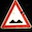
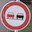
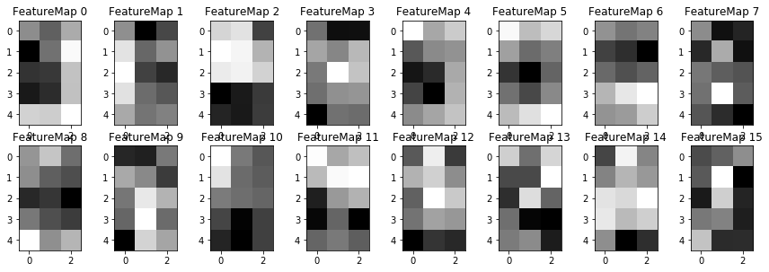
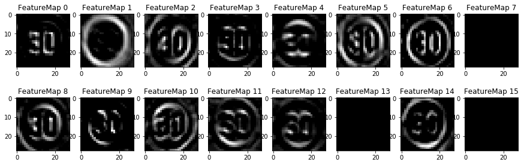
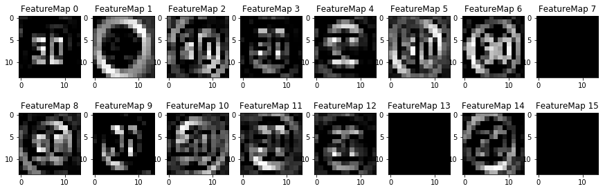

# Traffic Sign Recognition
---
## Build a Traffic Sign Recognition Project

The goals / steps of this project are the following:
* Load the data set (see below for links to the project data set)
* Explore, summarize and visualize the data set
* Design, train and test a model architecture
* Use the model to make predictions on new images
* Analyze the softmax probabilities of the new images
* Summarize the results with a written report

#### Rubric Points

Here I will consider the [rubric points](https://review.udacity.com/#!/rubrics/481/view) individually and describe how I addressed each point in my implementation.  

Here is a link to my [project code](https://github.com/leros/Traffic-Sign-Classifier/blob/master/Traffic_Sign_Classifier.ipynb)

## Data Set Summary & Exploration

I used the python and numpy to calculate summary statistics of the traffic
signs data set:

* The size of training set is 34799
* The size of the validation set is 4410
* The size of test set is 12630
* The shape of a traffic sign image is (32, 32, 3)
* The number of unique classes/labels in the data set is 43

### Visualization of the dataset

Here is an exploratory visualization of the data set. It is a bar chart showing the distribution of the classes. The distribution is unbalanced.


### Examples of Signs
 
 


## Design and Test a Model Architecture

My final model consisted of the following layers:

| Layer         		|     Description	        					|
|:---------------------:|:---------------------------------------------:|
| Input         		| 32x32x3 RGB image   							|
| Convolution     	| 1x1 stride, valid padding, outputs 28x28x16 	|
| RELU					|												|
| Max pooling	      	| 2x2 stride, valid padding, outputs 14x14x16 				|
| Convolution     	| 1x1 stride, valid padding, outputs 10x10x32 	|
| RELU					|												|
| Max pooling	      	| 2x2 stride, valid padding, outputs 5x5x32 				|
| Flatten |output 800|
| Fully connected		| input 800, output 400      									|
| RELU |apply dropout after activation |
| Fully connected		| input 400, output 200			|
| RELU |apply dropout after activation |
| Fully connected		| input 200, output 43			|


### Train

To train the model, I used an `AdamOptimizer`, the hyperparameters I chose were:
- batch size: 128
- epochs: 50
- learning rate: 0.001
- keep probability: 0.5

My final model results were:
* training set accuracy of 0.998
* validation set accuracy of 0.957
* test set accuracy of 0.946

I built the model based on the LeNet architecture. I chose the architecture because the objects to be classified in the traffic sign project are similar to the objects in the LeNet project. However, there are more classes in the traffic sign projects.


At the very beginning, I merely updated the number of input channels from 1 to 3 and the number of classes from 10 to 43, and I could reach a 85% of validation accuracy. In order to improve the accuracy, I ran the training with more epochs. Additionally, I made each layer larger by increasing the number of nodes. Then I observed the issue of overfitting: the training accuaray was almost 1.0, while the validation accuracy was just about 0.88. To resolve the problem I applied Dropout to fully connected layers. I also tried decaying the learning rate when using `AdamOptimizer`. However, the experiments were not successful. I tried setting the decaying rate to 0.1 and 0.5, neither worked. I cannot say the overfitting problem got fully resolved, but I think I was on the right track.  

In the end, the validation accuracy was about 0.96, and the test accuracy was about 0.95.


### Test the model on new images

Here are five German traffic signs that I found on the web:






In terms of the qualities of the signs in the images that are of interest, the second image is hard to classify due to the noise in the background. For other images, the signs are all pretty clear.

Considering the traits of the signs, the second sign should be easy to predict. It's the only inverted triangle in the signs. The first and the third signs are a bit similar. They both have triangle shape. The fourth one is kind of unique. The last one would be a challenge. There are several signs for speed limits, and they are all look similar except that the numbers inside the circle are different.


Here are the results of the prediction:

| Image			        |     Prediction	        					|
|:---------------------:|:---------------------------------------------:|
| General caution      		| General caution   									|
| Yield     			| Yield 										|
| Bumpy road					| Bumpy road											|
| No passing	      		| No passing					 				|
| Speed limit (30km/h)		| Speed limit (30km/h)      							|

Surprisingly, the model was able to correctly guess 5 of the 5 traffic signs, which gives an accuracy of 100%.
I would say the performance on the new images is similar to the accuracy results of the test set given we only have 5 data points here.

The model performs super well on predicting the classes of these new images.

```
[[ 1.000  0.000  0.000  0.000  0.000]
 [ 1.000  0.000  0.000  0.000  0.000]
 [ 0.984  0.016  0.000  0.000  0.000]
 [ 1.000  0.000  0.000  0.000  0.000]
 [ 1.000  0.000  0.000  0.000  0.000]]
 [[18 26 11 32 40]
 [13  2 28  3  0]
 [22 37  0 17 18]
 [ 9 10 16 19 41]
 [ 1  0  2  3  4]]
```
The model was very certain about the predication it gave, i.e. 100% sure about the signs of image 1, 2, 4, and 5, and 98.4% sure about the sign of image 3.

### Visualizing the Neural Network
I outputted the feature maps of the first conv layer: the original weights, the ReLU activation, and the one after maxpooling.

The image used for visualization


The feature map: weights



The feature map: ReLU activation



The feature map: maxpooling



I am not sure how to interpret the maps, but the map for ReLU activation seems catch the profile of the sign.
The circle and the number inside it are quite obvious.
